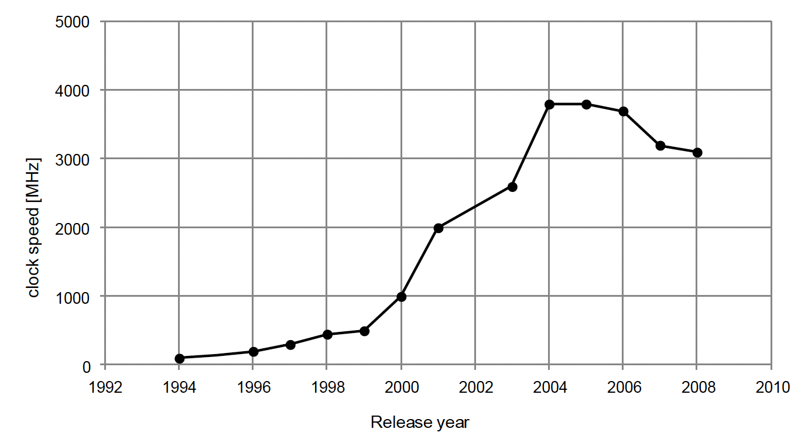

# Why Parallelization

In the good old days, software speedup was achieved by using a CPU with a higher clock speed, which increased significantly with each passing year. However, around 2004 when Intel’s CPU clock speed reached 4GHz, the increase in power consumption and heat dissipation formed what is now known as the “power wall”, which effectively caused the CPU clock speed to level off (**Figure 1.1**1).

The processor vendors were forced to give up their efforts in increasing the clock speed, and instead to adopt a new method of increasing the number of cores within the processor. Since the CPU clock speed has either remained the same or even slowed down in order to save the power, old software designed to run on a single processor does not get any faster just by upgrading the CPU to the newest model. To get the most out of the current processors, the software must be designed to take full advantage of the multiple cores and perform execution in parallel.

Today, dual-core CPUs are commonplace even for the basic consumer laptops. This shows that parallel processing is not just useful for performing advanced computations, but that it is becoming common in various applications. \
\
**Figure 1.1: Intel CPU Clock Speed by Year**

